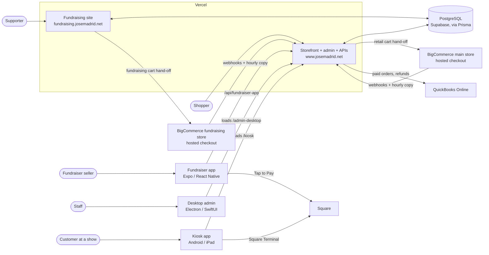

# Jose Madrid Salsa — Platform Documentation

This repository holds the documentation for the **Jose Madrid Salsa platform**: the
websites, apps and back office that run a salsa company in Zanesville, Ohio. The code
itself lives in a separate monorepo, [`jordolang/josemadridsalsa`](https://github.com/jordolang/josemadridsalsa).

Start here if you want to know what the platform is made of, how the pieces talk to each
other, and where to go next. Everything below was checked against the monorepo at commit
`12ec8fa` (6 October 2026).

> **Planning in progress.** The full outline for the rest of this documentation, and the
> list of what is stale or missing today, is in
> [`docs/DOCUMENTATION_PLAN.md`](docs/DOCUMENTATION_PLAN.md).

---

## The platform in one minute

Jose Madrid sells salsa four ways: online to retail shoppers, through school and club
**fundraisers**, face to face at **shows and events**, and **wholesale** to shops. The
platform has one app for each of those front doors, all reading and writing **one shared
database**, with **BigCommerce** still doing the retail and fundraising checkout during
the cutover from the old josemadridsalsa.com store.

| What | Who uses it | Where it lives | Code |
|---|---|---|---|
| **Storefront** | Shoppers, wholesale buyers | [www.josemadrid.net](https://www.josemadrid.net) | `apps/storefront` |
| **Admin panel** | Jose Madrid staff | www.josemadrid.net/admin | `apps/storefront/app/admin` |
| **Fundraising site** | Groups raising money and their supporters | [fundraising.josemadrid.net](https://fundraising.josemadrid.net) | `apps/fundraising` |
| **Fundraiser mobile app** | Students and sellers taking orders | App Store and Google Play | `apps/fundraiser-app` |
| **Desktop admin apps** | Staff at the office | Windows installer and macOS disk image | `apps/windows-admin`, `apps/macos-admin` |
| **Self-order kiosks** | Customers at shows | Android tablet or iPad at the booth | `apps/android-kiosk`, `apps/ios-kiosk` |
| **Developer docs site** | Engineers | Its own Vercel project | `apps/docs` (and this repo) |

## How the pieces fit together



The short version of that picture:

- **One database.** Every web app uses the same PostgreSQL database (hosted on Supabase,
  previously Neon) through Prisma. The schema lives in
  `apps/storefront/prisma/schema.prisma`; the fundraising app generates its client from
  that same file.
- **One shared code package.** `packages/core` holds the code more than one app needs:
  Prisma, sign-in and permissions, email, UI pieces, the fundraising domain logic and the
  BigCommerce client. Each app's `@/` import looks in the app first, then in core.
- **The storefront is the hub.** The admin panel, the mobile app's API, the kiosk
  screens, the desktop apps' update feed, every webhook and every scheduled job live in
  the storefront deployment.
- **BigCommerce is the checkout for now.** With `NEXT_PUBLIC_COMMERCE_BACKEND=bigcommerce`,
  a shopper's cart is rebuilt in BigCommerce and they pay on BigCommerce's hosted
  checkout. BigCommerce orders are copied back into the platform's order table by
  webhook, with an hourly job as a safety net. Fundraiser campaign sales keep the
  platform's own checkout, because BigCommerce has no idea of campaign pricing.
- **Square takes in-person cards.** The fundraiser app (Tap to Pay or a Square Reader)
  and the kiosks (Square Terminal) charge through Jose Madrid's Square account.
- **QuickBooks Online is the books.** Paid orders and refunds sync to it hourly.

## Each app at a glance

### Storefront — `apps/storefront`

The primary Next.js 16 app and the home of almost all product code: the public shop,
customer accounts, cart and checkout, recipes and the Heat Index blog, wholesale, the
staff admin panel (`/admin`), the desktop shell (`/admin-desktop`), point of sale
(`/pos`), kiosk screens (`/kiosk`), about fifty API groups under `app/api`, every
webhook (`stripe`, `paypal`, `square`, `easypost`, `resend`, BigCommerce) and thirteen
Vercel cron jobs.

- **Run:** `npm run dev` from the monorepo root → http://localhost:3000
- **Deploy:** Vercel project `josemadridsalsa`, root directory `apps/storefront`, `main` only.
  The build runs `prisma migrate deploy`, regenerates the Prisma client, seeds
  permissions, then `next build`.

### Fundraising site — `apps/fundraising`

Its own Next.js app and its own Vercel project, replacing the old
josemadridsalsafundraising.com. It serves the fundraising site (home, shop, groups, cart,
sign-up), every public fundraiser page (`/fundraisers`, `/f`, `/arena`), the fundraiser
portal and their APIs. Its `/shop` reads the BigCommerce fundraising store live and hands
carts to that store's checkout; the group list is BigCommerce's checkout dropdown. The
storefront redirects (308) old fundraiser paths here, and this app sends main-site paths
back.

- **Run:** `npm run dev:fundraising` → http://localhost:3001
- **Deploy:** its own Vercel project, `main` only, skipped by `turbo-ignore` when nothing
  it depends on changed.

### Fundraiser mobile app — `apps/fundraiser-app`

One Expo / React Native app (`net.josemadrid.fundraiser`) that every group uses. A seller
enters their group ID and group PIN, picks a personal PIN, and takes orders: a
Square-style register for face-to-face sales, or a phone-order form for delivery later.
Cards go through Square's Mobile Payments SDK, wired in by a custom config plugin
(`plugins/with-square-mobile-payments.js`). All prices and orders come from the
storefront's `/api/fundraiser-app`. It is **not** an npm workspace; it has its own lockfile.

- **Run:** `cd apps/fundraiser-app && npm install && npx expo start`. Square's native code
  needs a development build (`npx expo run:ios` / `run:android`), not Expo Go.
- **Ship:** EAS Build and Submit (`npm run build:ios`, `npm run submit:ios`, and the
  Android equivalents).

### Desktop admin apps — `apps/windows-admin`, `apps/macos-admin`

Native windows onto the real admin panel. Both open the desktop shell at
`https://www.josemadrid.net/admin-desktop` and can reach every admin page from there, so a
new admin feature reaches the desktop the day it deploys. They add native menus,
printing, save dialogs, an offline screen, and on Windows, automatic updates.

- **Windows:** Electron 44 + TypeScript, packaged by electron-builder as an NSIS
  installer (`JoseMadridSalsaAdmin-Setup-<version>.exe`). Run with
  `npm run start --workspace=@jose-madrid/windows-admin`.
- **macOS:** SwiftUI + WKWebView, built by `apps/macos-admin/build-app.sh` into a `.dmg`.
- **Release:** the **Desktop Apps** GitHub workflow (run by hand, or by pushing a
  `desktop-v*` tag) builds both, signs them when certificates are configured, publishes
  the update feed to Vercel Blob (served through `/api/desktop/updates`), and archives a
  GitHub release.

### Self-order kiosks — `apps/android-kiosk`, `apps/ios-kiosk`

Thin native apps that lock a tablet to the storefront's `/kiosk` page and drive the
receipt printer and barcode scanner. Customers build an order on screen and pay on a
Square Terminal. The Android app builds with Gradle; the iPad app is generated with
XcodeGen.

### Everything else

- **`apps/admin`** is a placeholder that redirects to the storefront's `/admin`. It is not
  deployed.
- **`apps/agent`** is an internal AI operations agent built on the eve framework. It is
  local tooling and is left out of `npm run build`.
- **`apps/docs`** is the Fumadocs developer documentation site that ships with the code.
  See [Where the docs live](#where-the-docs-live).

## Working in the monorepo

```bash
git clone https://github.com/jordolang/josemadridsalsa
cd josemadridsalsa
nvm use                      # Node 20 per .nvmrc (CI and Vercel use 22)
npm install                  # always from the repo root
cp .env.example .env.local   # fill in DATABASE_URL, NEXTAUTH_SECRET, MASTER_KEY at minimum
npm run db:generate
npm run dev                  # storefront on :3000
```

| Command | What it does |
|---|---|
| `npm run dev:all` | Every web app through Turborepo |
| `npm run dev:fundraising` / `dev:docs` / `dev:admin` | One app on :3001 / :3002 / :3003 |
| `npm run test && npm run lint && npm run type-check && npm run build` | The checks to pass before any pull request |
| `npm run db:migrate` / `db:seed` / `db:studio` | Database migrations, seed data, Prisma Studio |

Production secrets are Vercel environment variables, set per project. Nothing is shared
between the storefront and fundraising projects automatically.

## Where the docs live

There are two copies of the developer documentation today, and they have drifted:

| | This repo (`salsadocs`) | Monorepo `apps/docs` |
|---|---|---|
| Pages | 115 | 169 |
| Last synced | June 2026 | Current |
| Covers BigCommerce, fundraising site, mobile app, kiosks, desktop apps | No | Yes |

The monorepo's own deployment guide describes `apps/docs` as the successor to this repo.
Choosing one home, and bringing the other in line, is the first step of the
[documentation plan](docs/DOCUMENTATION_PLAN.md).

## Running this docs site

This repo is a [Fumadocs](https://fumadocs.dev) site on Next.js 16. Pages are MDX files in
`content/docs`; the sidebar order comes from each folder's `meta.json`.

```bash
npm install
npm run dev     # http://localhost:3000
npm run build
```

`imported/josemadridsalsa-docs/` holds older Markdown notes brought over from the
monorepo in June 2026. They are source material, not published pages.
